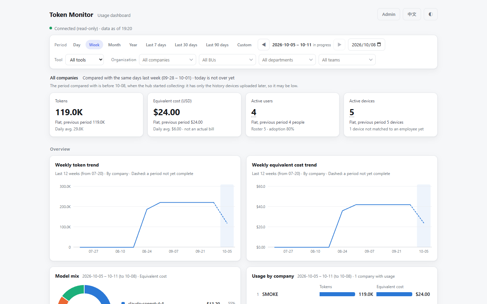
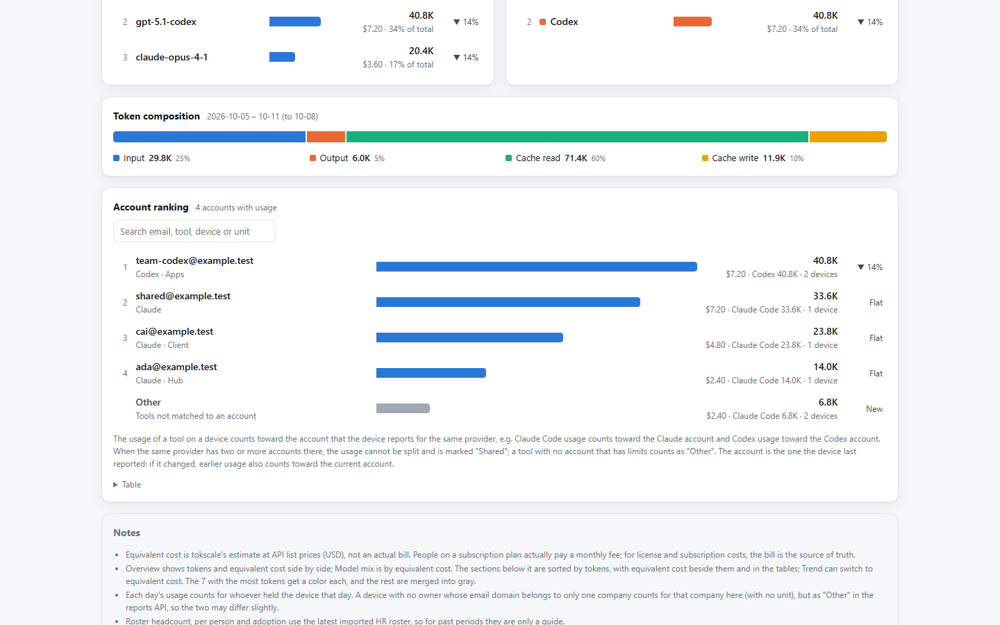
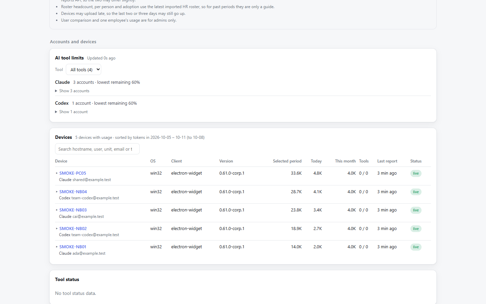
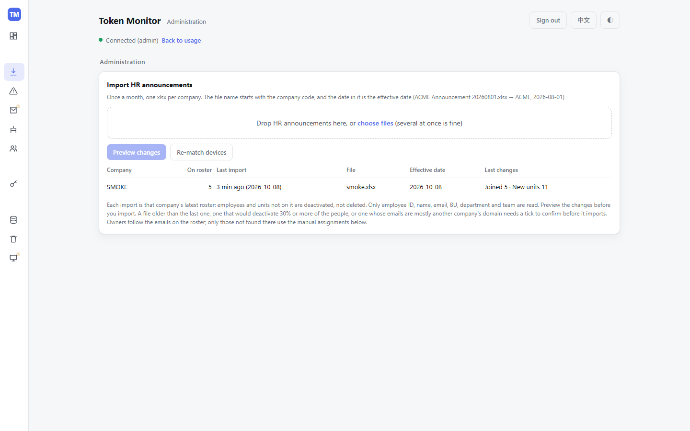
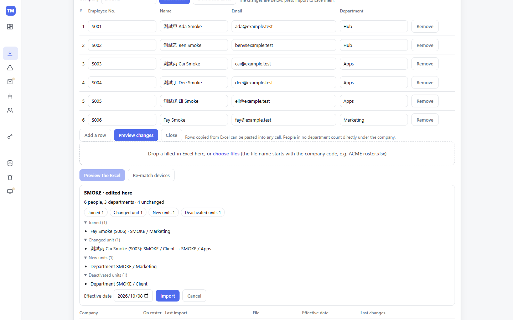
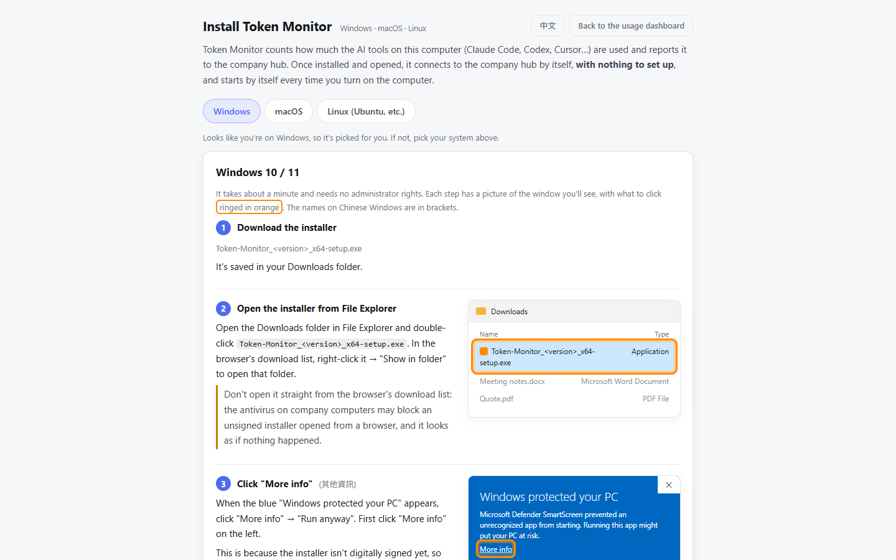
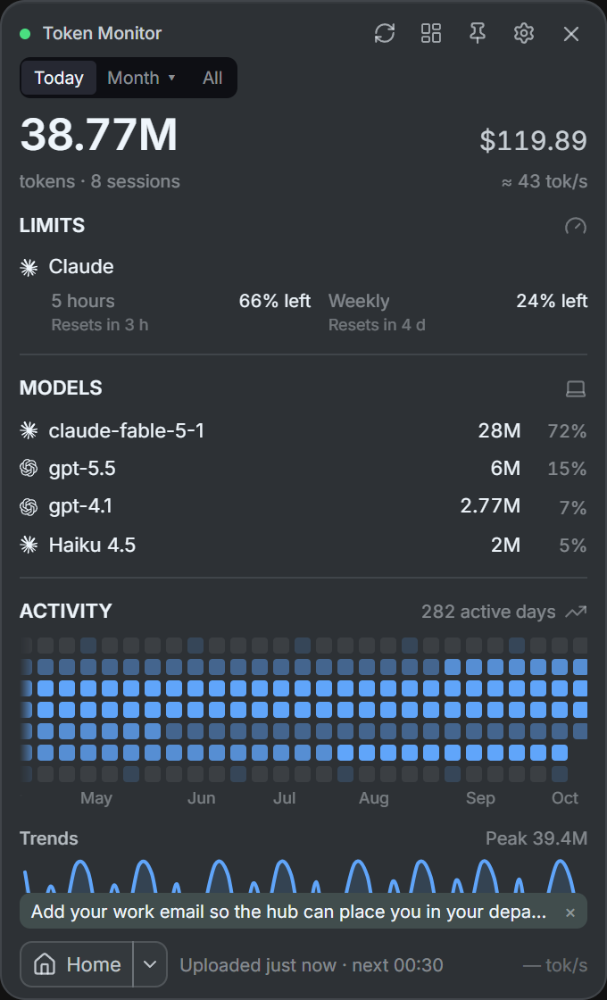
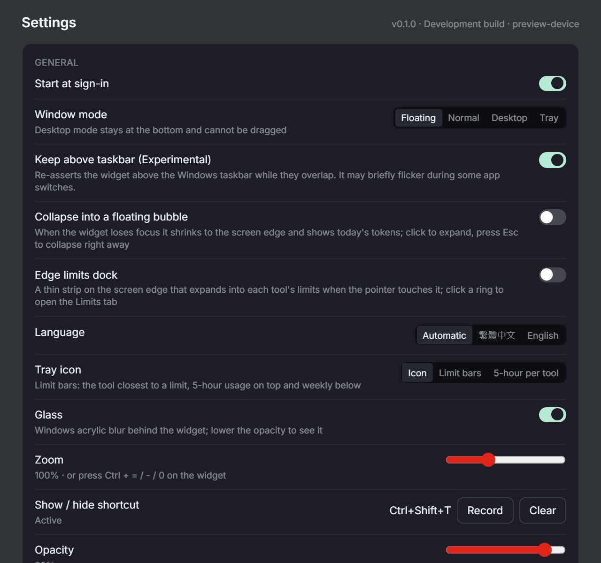
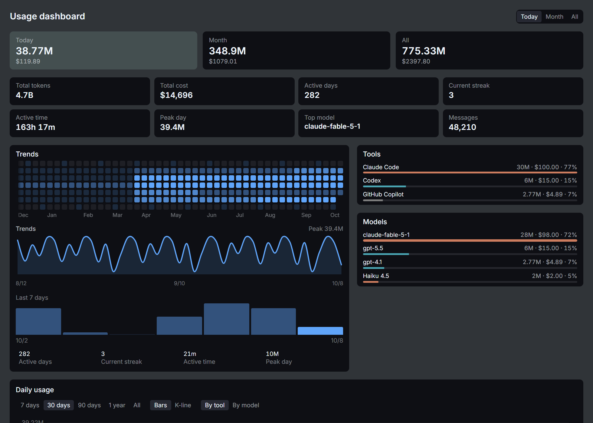

# Open Token Monitor

[繁體中文](README.md) | **English**

A self-hosted team edition of [Token Monitor](https://github.com/Javis603/token-monitor) for organisations: track AI coding tool usage (Claude Code, Codex, Cursor, Copilot and more) across every employee's machine, in one hub with a database, an organisation chart, a dashboard and reports.

Upstream Token Monitor is a desktop widget with an optional hub. This repository keeps upstream unchanged and adds what a company deployment needs on top of it:

- **Hub overlay** (`hub/`): PostgreSQL storage, admin, client and API-token permission tiers, an org roster (employee no., name, email, department) edited on the web page or imported from an Excel template, automatic device ownership by email, a dashboard that groups usage by company → department (a team counts in its department), a reporting API, backups and history purging. It runs in front of upstream's own hub.
- **Electron client packaging** (`client/`, `packaging/`): upstream's desktop app, packaged with your hub URL and client key preset. On first run it connects to your hub, uploads every 30 minutes and turns on launch at login.
- **Rust/Tauri client** (`tauri/`): a lighter client written in Rust. It uploads exactly what upstream's client uploads, field for field, and also has a headless `tm-agent`.

The docs are in Traditional Chinese.

## Screenshots

The hub's dashboard, org roster and install guide, with made-up data from `npm run smoke:hub`.

**Usage dashboard:** totals compared with the previous period, trends, model mix and usage by company and department, filtered by period, tool, company and department.



| Accounts | Devices and AI tool limits |
|---|---|
|  |  |

**Org roster:** one roster per company (employee no., name, email, department), edited on the page or downloaded as Excel, filled in and dropped back; the changes are previewed before they are saved.

| Editing the roster on the page | Previewing the changes before the import |
|---|---|
|  |  |

**Install guide** (`/install`): what employees follow to download and install the client.



**Rust/Tauri client** (`tauri/`): the widget on each employee's computer. These are its preview mode, with made-up data (`cd tauri && npm run dev`, then open it in a browser).

| Widget | Settings |
|---|---|
|  |  |

Usage dashboard: today's, this month's and all-time usage, an activity heatmap, trends, and the share of each tool and model.



## Layout

```
upstream/     upstream token-monitor (git subtree, pinned to a release tag, never edited here)
hub/          the hub overlay        docker/  deploy/   container image and deployment scripts
client/       Electron client entry  packaging/          client build (electron-builder)
tauri/        Rust/Tauri client      scripts/            release and upstream tools
docs/         documentation          tests/              node --test suites
```

## Quick start

Requires Node.js 22.15 or newer, plus Docker for the containerised hub.

```bash
git clone https://github.com/markku636/open-token-monitor.git
cd open-token-monitor
npm ci
cp .env.example .env          # set TOKEN_MONITOR_SECRET, TOKEN_MONITOR_CLIENT_SECRETS, POSTGRES_PASSWORD, TOKEN_MONITOR_DB_PASSWORD
docker build -f docker/Dockerfile -t token-monitor-hub .     # the Compose file never pulls the hub image
docker compose -f docker/compose.yml --env-file .env up -d   # hub + PostgreSQL on port 80
# or, for development against the JSON store: npm run hub
# or, to look around with made-up data and no Docker: npm run smoke:hub
```

Make each key and password a long random hex value: `node -e "console.log(require('crypto').randomBytes(24).toString('hex'))"`. Then open <http://localhost/>, choose **Admin** and paste `TOKEN_MONITOR_SECRET`. If port 80 is taken, set `TOKEN_MONITOR_HOST_PORT` in `.env`.

Once signed in, build the org roster under **Org roster** on the admin page; no file from an HR system is needed:

1. Type a company code (letters, digits and `-`, e.g. `ACME`).
2. Choose **Edit roster** and fill it in, or **Download Excel** for the template (employee no., name, email, department), fill it in and drop it back. Rows copied from Excel can be pasted straight into the table on the page.
3. Choose **Preview changes** (**Preview the Excel** for a file), check the changes and choose **Import**.

Update it the same way whenever the roster changes; people no longer on it are deactivated, not deleted. A device goes to a person automatically when the email its client reports is on the roster.

Then, depending on what you need:

| To | Read |
|---|---|
| Configure and run the hub | [docs/hub.zh-TW.md](docs/hub.zh-TW.md), [docs/docker.md](docs/docker.md), [docs/postgres.zh-TW.md](docs/postgres.zh-TW.md) |
| Build the Electron client for your organisation | [docs/client-build.zh-TW.md](docs/client-build.zh-TW.md), [docs/client-setup.zh-TW.md](docs/client-setup.zh-TW.md) |
| Build or develop the Rust client | [tauri/README.md](tauri/README.md) |
| Pull hub data from other systems | [docs/reports-api.zh-TW.md](docs/reports-api.zh-TW.md) |
| Put your own logo on the client | [client/README.md](client/README.md) |

Each organisation builds its own client installer, because the installer carries your hub's address and client key.

## Updating when upstream releases a new version

This project is built on top of [Javis603/token-monitor](https://github.com/Javis603/token-monitor). Upstream keeps releasing new versions, and we pull them in regularly.

**The rule: not one line of upstream's code is changed here.**

- The `upstream/` folder is a complete, untouched copy of one upstream release. If anyone edits it, `npm run verify` fails.
- What we add (the hub's database, the dashboard, the company client…) lives outside `upstream/` and plugs into it.
- Every place where it plugs in is covered by a test or listed in [upstream-touchpoints.json](upstream-touchpoints.json). When upstream changes one of them, a test fails and tells you what to update.

**Doing it yourself, in three commands:**

```bash
npm run upstream:status            # 1. Check: which version we use, and upstream's newest
npm run upstream:update -- next    # 2. Move up one version: pull it in and run the tests
npm run upstream:impact            # 3. See the impact: what to check and fix this time
```

Move up one version at a time. When every test passes, merge; otherwise fix what step 3 lists. The full steps are in [docs/upstream-upgrade.zh-TW.md](docs/upstream-upgrade.zh-TW.md) and [AGENTS.md](AGENTS.md) ("升級上游").

**Letting an AI do it:**

- **GitHub reminds you:** [upstream-watch](.github/workflows/upstream-watch.yml) checks upstream every Monday and opens a pull request with a checklist when there's a new version.
- **Comment `@claude` on that pull request:** Claude follows the steps above and finishes the update ([claude.yml](.github/workflows/claude.yml)). The repository needs a `CLAUDE_CODE_OAUTH_TOKEN` or `ANTHROPIC_API_KEY` secret first.
- **Locally in Claude Code:** type [`/upstream-update`](.claude/skills/upstream-update/SKILL.md) to run the whole procedure.

## Development

```bash
npm run verify                         # upstream check + lint + tests (hub overlay)
cd tauri && npm ci && npm run verify   # Rust client: frontend build, vitest, cargo test, clippy
npm --prefix tauri run test:compat     # Rust client vs. upstream's JavaScript and the overlay hub
```

Conventions and the rules that tests enforce are in [AGENTS.md](AGENTS.md).

## License

[MIT](LICENSE). Upstream Token Monitor is © Javis, MIT ([upstream/LICENSE](upstream/LICENSE)); see [THIRD_PARTY_NOTICES.md](THIRD_PARTY_NOTICES.md). This project is not affiliated with or endorsed by the upstream authors.
