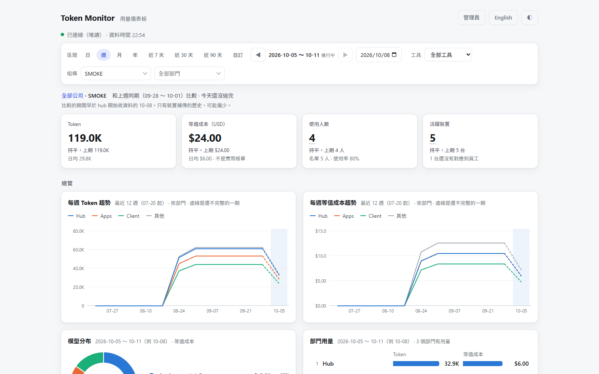
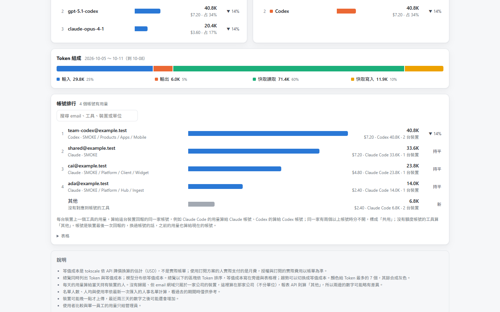
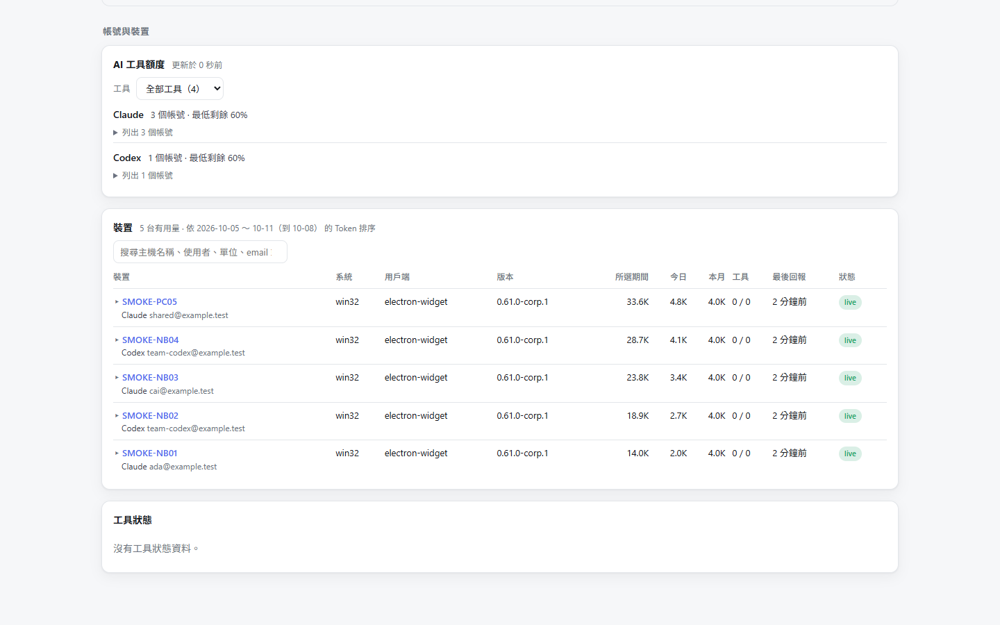
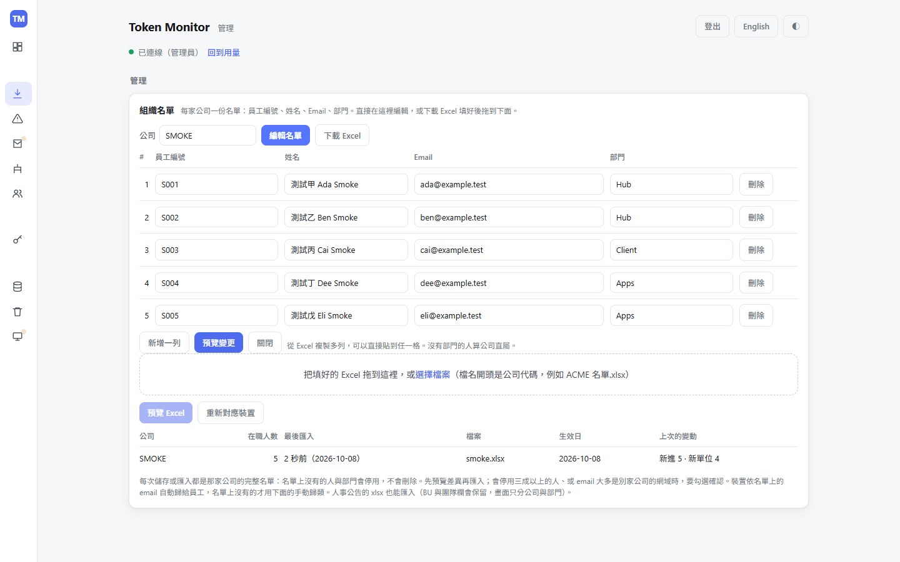
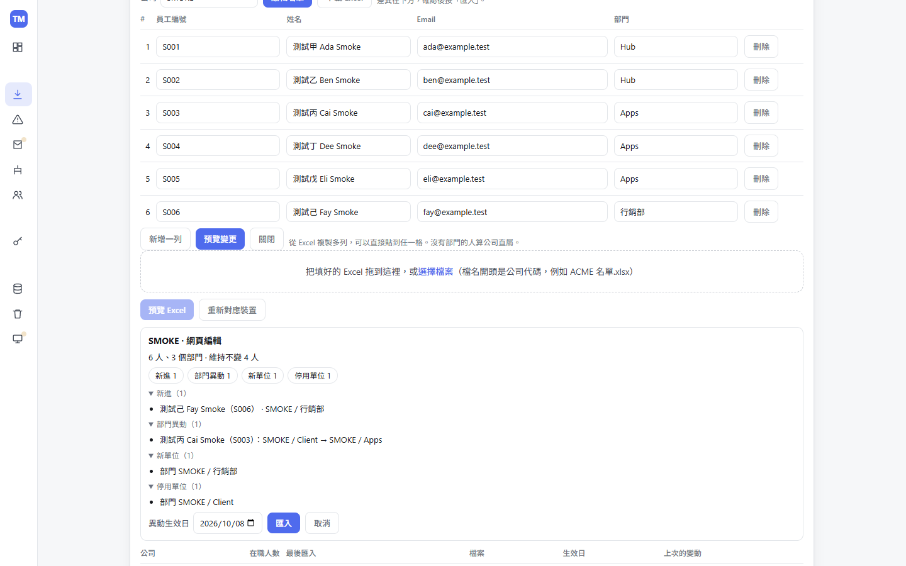
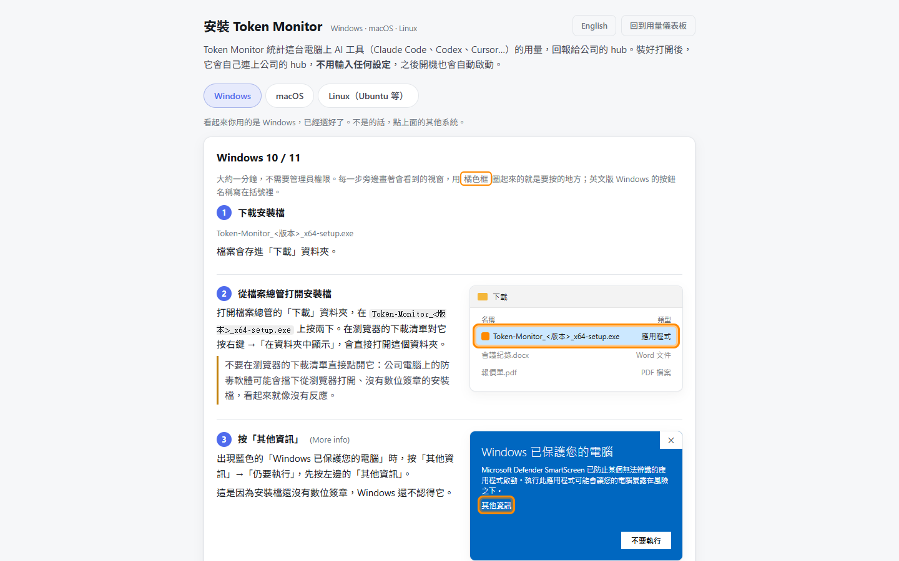
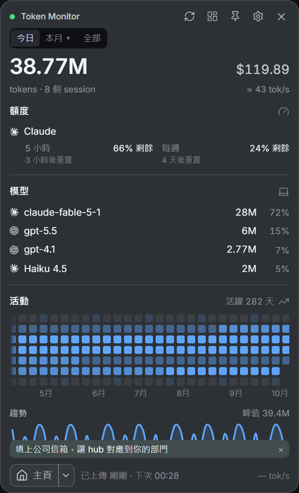
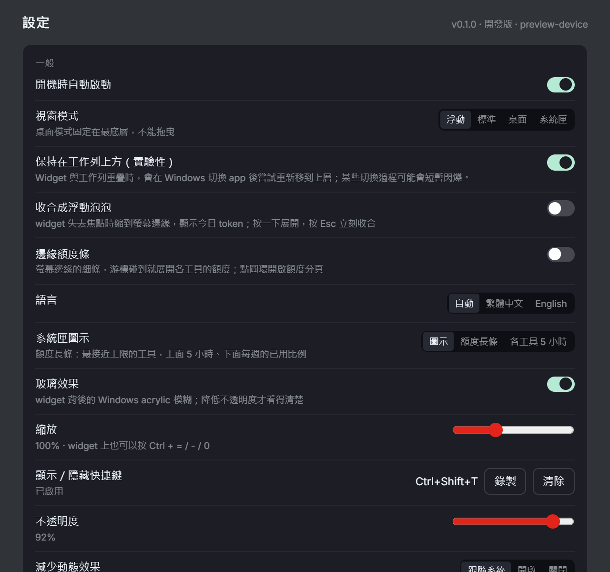
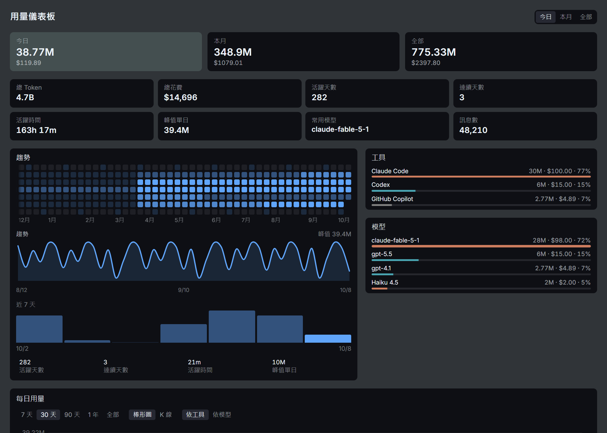

# Open Token Monitor

**繁體中文** | [English](README.en.md)

[Token Monitor](https://github.com/Javis603/token-monitor) 的自架團隊版，給組織使用。它把每位員工電腦上 AI coding 工具（Claude Code、Codex、Cursor、Copilot 等）的用量，集中到同一個 hub。hub 有資料庫、組織架構、dashboard 與報表。

上游 Token Monitor 是桌面小工具，hub 是選用的。這個 repo 不改上游，只在上面加上公司部署需要的部分：

- **hub overlay**（`hub/`）：
  - PostgreSQL 儲存。
  - 管理員、client、API token 三種權限。
  - 組織名單（員工編號、姓名、Email、部門）直接在網頁上編輯，或下載 Excel 範本填好再匯入，並依 email 自動判定裝置的主人；dashboard 依「公司 → 部門」兩級篩選與比較。
  - 用量 dashboard、報表 API、備份與刪除歷史資料。
  - 它疊在上游的 hub 前面執行。
- **Electron 用戶端打包**（`client/`、`packaging/`）：上游的桌面 app，打包時預填你的 hub 網址與 client 金鑰。第一次開啟就會連上 hub、每 30 分鐘上傳一次，並設定開機自動啟動。
- **Rust/Tauri 用戶端**（`tauri/`）：用 Rust 寫的輕量用戶端。它上傳的內容和上游用戶端逐欄相同，另外提供不需要畫面的 `tm-agent`。

## 和上游版的差異

**hub**

| 項目 | 本 repo | 上游 |
|---|---|---|
| 資料儲存 | PostgreSQL（開發時可用 JSON 檔），每日備份、可刪除歷史資料 | JSON 檔（`data/devices.json`） |
| 權限 | 管理員、client、API token 三種；client 金鑰只能上傳與讀取，可以有多把 | 一把共用金鑰 |
| 網頁 | 用量 dashboard、帳號排行、裝置與額度、管理頁、安裝說明（`/install`） | 沒有網頁，只有 API |
| 組織 | 依公司、部門篩選與比較；名單在網頁上編輯或用 Excel 匯入，依 email 把裝置歸給員工 | 沒有 |
| 報表 | 報表 API，給其他系統讀 | 沒有 |
| 上傳檢查 | 檢查每筆上傳的格式與大小，不合格的回 400 並說明原因 | 基本檢查 |

**用戶端**

| 項目 | Electron 公司版 | Rust 版 | 上游 |
|---|---|---|---|
| 平台 | Windows、macOS（Apple 晶片）、Linux | Windows | Windows、macOS、Linux |
| 連上 hub | 公司打包預填 hub 與金鑰；GitHub 安裝檔在「多裝置同步」自己填 | 公司打包內建 hub 與金鑰；GitHub 安裝檔在設定的「公司 hub」自己填，金鑰存在 Windows 認證管理員 | 預設本機模式，自己設定 |
| widget 顯示的用量 | 只有這台電腦 | 這台電腦，另有全公司分頁 | 連上 hub 時是全部裝置的加總 |
| 上傳頻率 | 每 30 分鐘 | 預設每 10 分鐘，可選即時、10、20、30 分鐘 | 即時 |
| 開機自動啟動 | 預設開啟，開機時縮到工作列 | 預設開啟 | 關閉 |
| 自動更新 | 公司 GitLab Release，或本 repo 的 GitHub Release | 公司 hub，或本 repo 的 GitHub Release | 上游的 GitHub Release |
| 不需要畫面的上傳程式 | 沒有 | `tm-agent` | 上游的 headless agent |
| 安裝檔簽章 | 沒有程式碼簽章（macOS 只有 ad-hoc） | 沒有程式碼簽章；更新檔有簽章驗證 | 有簽章 |

詳細的設定差異見 [docs/client-build.zh-TW.md](docs/client-build.zh-TW.md) 與 [tauri/README.md](tauri/README.md)。

## 畫面

hub 的用量 dashboard、組織名單與安裝說明。資料是 `npm run smoke:hub` 產生的假資料。

**用量 dashboard**：總量與上期比較、趨勢、模型分布與各公司、各部門的用量，可以依期間、工具、公司與部門篩選。



| 帳號排行 | 裝置與 AI 工具額度 |
|---|---|
|  |  |

**組織名單**：每家公司一份名單（員工編號、姓名、Email、部門），直接在網頁上編輯，或下載 Excel 填好再拖回來；儲存前先看差異。

| 網頁上編輯名單 | 預覽差異後匯入 |
|---|---|
|  |  |

**安裝說明**（`/install`）：員工照著下載、安裝用戶端。



**Rust/Tauri 用戶端**（`tauri/`）：員工電腦上的小工具。下面是它的預覽模式，用的是假資料（`cd tauri && npm run dev`，再用瀏覽器開）。

| 小工具 | 設定 |
|---|---|
|  |  |

用量儀表板：今日、本月與全部的用量，活動熱度圖、趨勢，以及各工具、各模型的占比。



## 快速開始

需要 Node.js 22.15 以上；用容器跑 hub 時另外需要 Docker。

```bash
git clone https://github.com/markku636/open-token-monitor.git
cd open-token-monitor
npm ci
cp .env.example .env          # 填 TOKEN_MONITOR_SECRET、TOKEN_MONITOR_CLIENT_SECRETS、POSTGRES_PASSWORD、TOKEN_MONITOR_DB_PASSWORD
docker build -f docker/Dockerfile -t token-monitor-hub .     # Compose 不會自己拉 hub 映像
docker compose -f docker/compose.yml --env-file .env up -d   # hub + PostgreSQL，port 80
# 開發時也可以用 JSON 檔：npm run hub
# 不用 Docker、先用假資料看看：npm run smoke:hub
```

金鑰與密碼都用長的隨機 hex：`node -e "console.log(require('crypto').randomBytes(24).toString('hex'))"`。接著開 <http://localhost/>，按「管理員」貼上 `TOKEN_MONITOR_SECRET`。port 80 被佔用時，在 `.env` 設 `TOKEN_MONITOR_HOST_PORT`。

登入後到管理頁的「組織名單」建立名單，不需要人事系統的檔案：

1. 輸入公司代碼（英文字母、數字與 `-`，例如 `ACME`）。
2. 按「編輯名單」直接填，或按「下載 Excel」拿範本（欄位是員工編號、姓名、Email、部門），填好拖回框裡。從 Excel 複製多列也可以直接貼到網頁的表格。
3. 按「預覽變更」（Excel 是「預覽 Excel」）看差異，確認後按「匯入」。

之後名單有變動就照同樣的步驟更新；名單上沒有的人會停用，不會刪除。員工電腦上的用戶端回報的 email 對得上名單時，裝置會自動歸給那個人。

接下來看你要做什麼：

| 要做的事 | 文件 |
|---|---|
| 設定與執行 hub | [docs/hub.zh-TW.md](docs/hub.zh-TW.md)、[docs/docker.md](docs/docker.md)、[docs/postgres.zh-TW.md](docs/postgres.zh-TW.md) |
| 替自己的組織打包 Electron 用戶端 | [docs/client-build.zh-TW.md](docs/client-build.zh-TW.md)、[docs/client-setup.zh-TW.md](docs/client-setup.zh-TW.md) |
| 打包或開發 Rust 用戶端 | [tauri/README.md](tauri/README.md) |
| 讓其他系統讀 hub 的資料 | [docs/reports-api.zh-TW.md](docs/reports-api.zh-TW.md) |
| 換成自己的 logo | [client/README.md](client/README.md) |

安裝檔帶著 hub 網址與 client 金鑰，所以每個組織要自己打包用戶端。

## 上游出新版時怎麼更新

本專案建立在上游 [Javis603/token-monitor](https://github.com/Javis603/token-monitor) 之上。上游會持續出新版，我們要定期把新版拉進來。

**原則：上游的程式碼一行都不改。**

- `upstream/` 資料夾是上游某一版的完整複本，原封不動。有人改了它，`npm run verify` 就會失敗。
- 我們自己加的功能（hub 的資料庫、dashboard、公司版用戶端……）都寫在 `upstream/` 外面，再接到上游上。
- 接到上游的每一個地方都有測試守著，或列在 [upstream-touchpoints.json](upstream-touchpoints.json)。上游改到這些地方時，測試會失敗，告訴你哪裡要跟著改。

**自己升級，三個指令：**

```bash
npm run upstream:status            # 1. 看版本：目前用哪一版、上游最新是哪一版
npm run upstream:update -- next    # 2. 升一版：拉進下一版，並自動跑測試
npm run upstream:impact            # 3. 看影響：列出這次要檢查與修改的地方
```

一次只升一版。測試全部通過就可以合併；沒通過就照第 3 步的清單修。完整步驟見 [docs/upstream-upgrade.zh-TW.md](docs/upstream-upgrade.zh-TW.md) 與 [AGENTS.md](AGENTS.md)「升級上游」。

**交給 AI 做：**

- **GitHub 自動提醒**：[upstream-watch](.github/workflows/upstream-watch.yml) 每週一檢查上游，有新版就自動開一個 PR，裡面附檢查清單。
- **在 PR 留言 `@claude`**：Claude 會照上面的步驟完成升級（[claude.yml](.github/workflows/claude.yml)）。repo 要先設定 `CLAUDE_CODE_OAUTH_TOKEN` 或 `ANTHROPIC_API_KEY` secret。
- **在本機用 Claude Code**：輸入 [`/upstream-update`](.claude/skills/upstream-update/SKILL.md)，一次跑完整個流程。

## 開發

```bash
npm run verify                         # 上游檢查 + lint + 測試（hub overlay）
cd tauri && npm ci && npm run verify   # Rust 用戶端：前端 build、vitest、cargo test、clippy
npm --prefix tauri run test:compat     # Rust 用戶端與上游 JavaScript、overlay hub 的相容測試
```

慣例與測試會檢查的規則見 [AGENTS.md](AGENTS.md)。

## 授權

[MIT](LICENSE)。上游 Token Monitor 為 © Javis，MIT 授權（[upstream/LICENSE](upstream/LICENSE)），見 [THIRD_PARTY_NOTICES.md](THIRD_PARTY_NOTICES.md)。本專案與上游作者沒有隸屬或背書關係。
