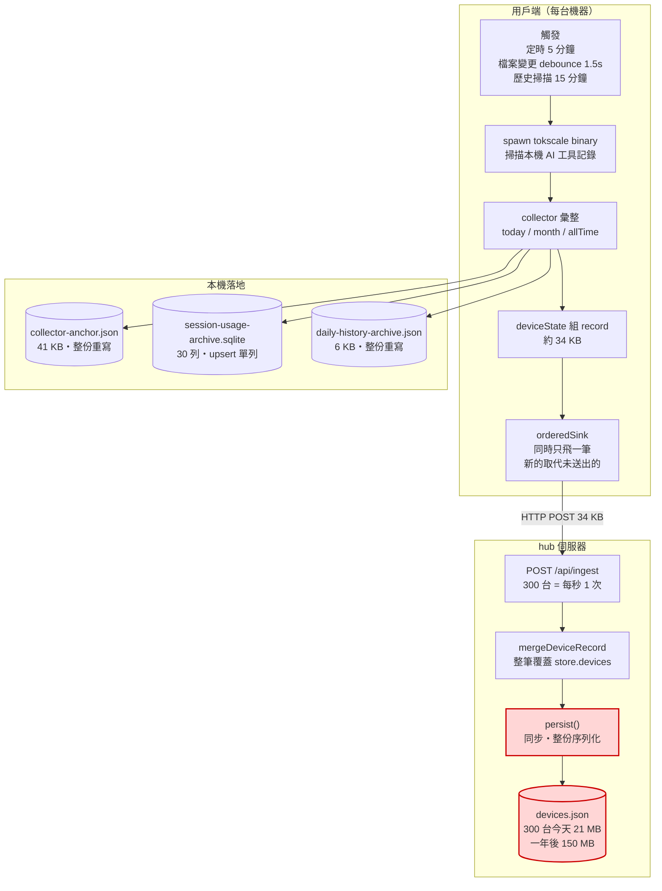
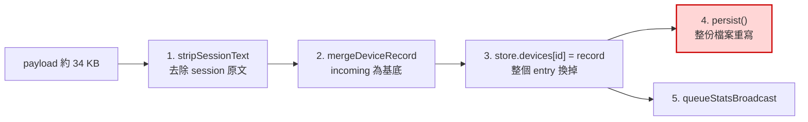
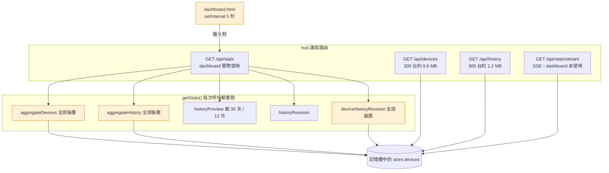

# 資料流與儲存架構

> 本文說明 Token Monitor 的**寫入**與**讀取**兩條資料路徑，標註各節點的實際數量級，並以 300 台裝置的規模為例，記錄現行架構的已知問題。
>
> 對應版本：v0.60.0，文中的行號以這一版為準；`upstream/` 裡的版本較新，行號可能對不上。文中 300 台的推估，皆由少量裝置的實測資料外推。

## 1. 名詞

| 名詞 | 指的是 |
|---|---|
| **用戶端 / device** | 每位使用者的機器，跑 `npm run agent`（headless-agent）或 Electron widget |
| **collector** | `src/shared/collector.js`，呼叫 tokscale 掃描本機 AI 工具用量 |
| **hub** | `src/hub/server.js`，集中接收各裝置回報的伺服器 |
| **tokscale** | 外部 CLI binary，讀取各家 AI 工具的本機記錄檔並輸出 JSON |

## 2. 寫入路徑



### 2.1 寫入量級總表

| 節點 | 頻率（單台） | 頻率（300 台） | 每次資料量 |
|---|---|---|---|
| tokscale 掃描 | 5 分鐘 | — | — |
| SQLite upsert | 每次採集 | — | 單列 |
| `daily-history-archive.json` | 每次採集 | — | 約 6 KB 整份 |
| `collector-anchor.json` | 每次採集 | — | 約 41 KB 整份 |
| POST `/api/ingest` | 5 分鐘 | **每秒 1 次** | 約 34 KB |
| hub `persist()` | — | **每秒 1 次** | **21 MB 整份**（一年後 150 MB） |

最後一列是整條路徑的瓶頸：用戶端送上來的是 34 KB，hub 卻要為此重寫 21 MB。**寫入放大約 600 倍**，且隨裝置數與時間持續惡化。

### 2.2 觸發時機

`createCollectorRuntime`（[src/shared/collector.js:2958](../upstream/src/shared/collector.js#L2958)）同時掛三種觸發：

| 觸發 | 預設值 | 位置 |
|---|---|---|
| 定時輪詢 | 5 分鐘 | collector.js:2970 |
| 檔案監看 | debounce 1.5 秒 | collector.js:2969 |
| 歷史掃描 | 15 分鐘 | collector.js:2959 |

agent 端預設值在 [src/agent/agent.js:35](../upstream/src/agent/agent.js#L35)，可用 `TOKEN_MONITOR_INTERVAL_MS` 覆寫。

### 2.3 用戶端的三個儲存

**`collector-anchor.json`** — 全掃快照。重啟後若 anchor 當日有效且 `configFingerprint` 相符，只掃 `--today`，month / allTime 用 `applyPeriodDelta` 推導，免去全量重掃（collector.js:3132）。

**`session-usage-archive.sqlite`** — 全專案唯一真正的資料庫：

```sql
sessions(session_key TEXT PRIMARY KEY, entry_json TEXT, revision INTEGER)
metadata(key TEXT PRIMARY KEY, value TEXT)
```

由 `capture()` 以 upsert 寫入（[src/shared/sessionUsageArchiveStore.js:341](../upstream/src/shared/usage/sessionUsageArchiveStore.js#L341)），使用 Node 內建 `node:sqlite` 的 `DatabaseSync`，無額外依賴。`metadata` 存 `schema-version`、`revision`、`pruned-day`、`pruned-month`。

**`daily-history-archive.json`** — 每日彙總，`writeJsonAtomic` 整份覆寫（dailyHistoryArchive.js:623）。寫前會 re-read 最新檔案再 rebase，所以 agent 與 widget 同時跑不會互相蓋掉。

### 2.4 上傳

`orderedSink`（[src/shared/orderedSink.js](../upstream/src/shared/orderedSink.js)）是節流關鍵：**同時只有一筆在飛，後來的取代還沒送出的那筆**，因此採集快過網路時不會塞爆 hub。

```
POST {hubUrl}/api/ingest
Authorization: Bearer {TOKEN_MONITOR_SECRET}
```

### 2.5 hub 如何更新 devices.json

用戶端每次送上來的是**完整快照**，不是差異。`deviceState.publish()`（[src/shared/deviceState.js:97](../upstream/src/shared/usage/deviceState.js#L97)）每次都重組整份 record：

```js
const record = { ...cloneValue(usagePart), ...cloneValue(envelope) };
if (limitsPart !== undefined) record.limits = cloneValue(limitsPart);
```

hub 收到後走 `ingest()`（[src/hub/server.js:176](../upstream/src/hub/server.js#L176)）五個步驟：



#### mergeDeviceRecord 的合併語意

[src/shared/usage.js:1191](../upstream/src/shared/usage.js#L1191)。基底是 **incoming**，預設整筆取代；只有三類欄位會從舊記錄承接：

| 欄位 | 規則 |
|---|---|
| `limits` | incoming **沒有**這個 key → 沿用舊的；**有** → 逐 provider 合併（`mergeDeviceLimits`，usage.js:1171） |
| `history` | incoming **沒有**這個 key → 沿用舊的；**有 → 整份取代** |
| `trackedClients` | 保留已不再追蹤的 client 用量（`preserveUntrackedClientUsage`） |

另有 `limitsOnly` 分支保留 `periods` 與數個診斷欄位，供舊版用戶端使用；現行 agent 與 widget 都送完整 record，不會走到。

**關鍵在 `history` 那列：它只會被整份取代，永遠不會累加。** hub 的歷史是用戶端 `daily-history-archive.json` 的**鏡像**，不是累積的檔案庫 —— 保留上限由用戶端決定，hub 無法留得比用戶端多。這是 5.1 的直接成因。

#### 落地

`persist()` 在每次 ingest 時同步呼叫（[src/hub/server.js:185](../upstream/src/hub/server.js#L185)），`writeJsonAtomic` 為全同步、帶 2 空格縮排的整份序列化（[src/shared/config.js:62](../upstream/src/shared/config.js#L62)）：

```js
fs.writeFileSync(tempPath, `${JSON.stringify(value, null, 2)}\n`, 'utf8');
fs.renameSync(tempPath, filePath);
```

實測縮排造成 **1.94 倍**膨脹。

## 3. 讀取路徑



### 3.1 讀取量級總表

| 路由 | 呼叫方式 | 300 台的回應大小 | 成本 |
|---|---|---|---|
| `/api/stats` | dashboard 每 5 秒輪詢 | 已裁切（30 天 / 12 月） | **每次對全部裝置跑 5 趟彙總** |
| `/api/devices` | 手動 | 約 9.8 MB | 全量序列化 |
| `/api/history` | 手動 | 約 1.2 MB | 全裝置彙總 |
| `/api/stats/stream` | SSE，dashboard 未使用 | — | 100 ms 合併後推播 |

所有讀取都直接打記憶體中的 `store.devices`，不碰磁碟 —— 因為整份資料本來就常駐記憶體。

### 3.2 dashboard 是輪詢，不是推播

v0.60.0 的 `src/hub/dashboard.html:706`（上游之後已移除這個頁面）是 `setInterval(refresh, 5000)`，只呼叫 `/api/stats`（dashboard.html:348）。hub 明明提供了 SSE 的 `/api/stats/stream`（server.js:292），dashboard 卻沒有使用。

這代表：**每開一個 dashboard 分頁，就是每 5 秒對全部 300 台裝置做一次完整彙總。** 10 個人同時看板，就是每秒 2 次全量彙總。而資料其實 5 分鐘才變一次，絕大多數的計算都是白做的。

## 4. 儲存位置一覽

### 用戶端（Windows）

```
C:\Users\<user>\AppData\Roaming\Token Monitor\
├── session-usage-archive.sqlite      session 級明細（SQLite）
├── daily-history-archive.json        每日彙總
├── collector-anchor.json             全掃快照
├── settings.json                     使用者設定
├── credentials.json                  各 provider 憑證
└── exchange-rates.json               匯率快取
```

路徑由 `sharedDataDir()` 決定（[src/shared/config.js:12](../upstream/src/shared/config.js#L12)）：macOS 為 `~/Library/Application Support/Token Monitor`，Linux 為 `~/.config/Token Monitor`。

### hub

| 啟動方式 | 檔案位置 |
|---|---|
| `npm run hub` | `<repo>/data/devices.json` |
| Docker | 容器內 `/data/devices.json`（volume `hub-data`） |
| Electron 內建 hub | `%APPDATA%\Token Monitor\hub-devices.json` |

上表是 v0.60.0 上游的 hub。公司版的 Docker 把資料存在 PostgreSQL（volume `postgres-data`），JSON 檔只是開機時從資料庫重建的快取，放在 tmpfs 的 `/cache/devices.json`，見 [docker.md](docker.md) 與 [postgres.zh-TW.md](postgres.zh-TW.md)。

優先序：`--dataFile` > `TOKEN_MONITOR_DATA_FILE` > 預設值（[src/hub/server.js:410](../upstream/src/hub/server.js#L410)）。

## 5. 現行架構的問題

hub 端**沒有資料庫，純寫 JSON 檔**。以下依嚴重度排序。

### 5.1 歷史資料不完整且無法回溯（最嚴重）

如 2.5 所述，`history` 欄位只要出現在 payload 就會被**整份取代**，永遠不累加。hub 是用戶端本機歷史的鏡像，不是 append-only 的事件庫 —— 歷史只保留「agent 當時正在跑、且掃得到」的那些天，裝置離線期間的資料**永久消失且無法補回**。

實測現有資料：

| 裝置 | 有資料的日期 | 月彙總 |
|---|---|---|
| 裝置 A | 09-14 ~ 09-18（5 天） | 僅 2026-09 |
| 裝置 B | 08-20, 08-31, 09-01, 09-03, 09-11, 09-17（有缺口） | 2026-08, 2026-09 |

本機 `daily-history-archive.json` 也只有 2026-09-14 ~ 09-21 共 6 天。

**結論：查不到完整的上個月，上上個月完全沒有。** `periods.allTime` 雖涵蓋 `--since 2024-01-01`，但它是單一總和，無法切分月份。對帳、月報、部門攤提這類需求，現行架構做不到。

### 5.2 寫入放大約 600 倍

見 2.1 表。用戶端送 34 KB，hub 重寫 21 MB，每秒一次，且隨時間線性惡化（一年後 150 MB）。

### 5.3 同步寫入阻塞 event loop

`writeFileSync` 是同步的。檔案越大 hub 卡越久，期間所有 HTTP 請求與 SSE 推播全部停擺。

### 5.4 讀取端重複全量彙總

見 3.2。dashboard 每 5 秒輪詢，`getStats()` 每次對全部裝置跑 5 趟彙總，而資料 5 分鐘才變一次。既有的 SSE 端點未被使用。

### 5.5 歷史無上限

`history.daily` 在 store 中**沒有保留上限**。`historyPreview` 的 30 天 / 12 個月只裁切回傳的 payload（[src/shared/history.js:485](../upstream/src/shared/history.js#L485)），落地那份無限成長。

### 5.6 無查詢能力

要回答「8 月全公司哪個 model 花最多」，必須整份載入記憶體自行掃描。沒有索引、沒有 SQL、無法只讀區間、無法增量查詢，外部 BI 工具也接不上。

### 5.7 無法水平擴展

store 全在單一 process 記憶體中，`.tmp` 暫存檔路徑固定，只能跑單一 hub 實例。無 HA、無法多副本。

### 5.8 粒度不足

hub 只收到**每裝置的日 / 月彙總**，沒有 session 級資料 —— 明細只留在各人機器的 SQLite。「誰在哪個專案花了多少」這類分析，光換資料庫不夠，上報 payload 本身要先擴充。

### 5.9 架構不一致

用戶端已用 SQLite，hub 反而用 JSON，同一專案兩套做法。

## 6. 改善方向

根因是「整份重寫」而非儲存引擎本身 —— 300 台、每秒 1 次 ingest、約 8 列/秒的寫入量，對 SQLite 而言僅約其能力的 0.2%。任何具備 row-level update 的儲存都能解決 5.2 與 5.3。

選 PostgreSQL 的理由是運維面而非效能面：

1. **外部分析存取** —— 開唯讀帳號給 Metabase / Grafana，SQLite 檔鎖在 Docker volume 裡做不到
2. **多實例與 HA** —— SQLite 為單機單寫入者
3. **備份還原** —— `pg_dump`、PITR、replication 皆為成熟工具
4. **JSONB** —— `perClient` / `perModel` 等半結構化欄位可直接存並建索引，新增 provider 不必改 schema

但 **5.1 與 5.8 不是換資料庫就能解決的**：歷史完整性要靠改成 append-only 的事件寫入模型，粒度要靠擴充上報 payload。這兩件事應在 schema 設計前先定案。**5.4 也與資料庫無關**，改用既有的 SSE 端點即可。

現成可參考的實作：[src/shared/sessionUsageArchiveStore.js](../upstream/src/shared/usage/sessionUsageArchiveStore.js) 已有完整的「建表 → 從舊 JSON 遷移 → prune」流程，hub 可沿用同一套模式。
